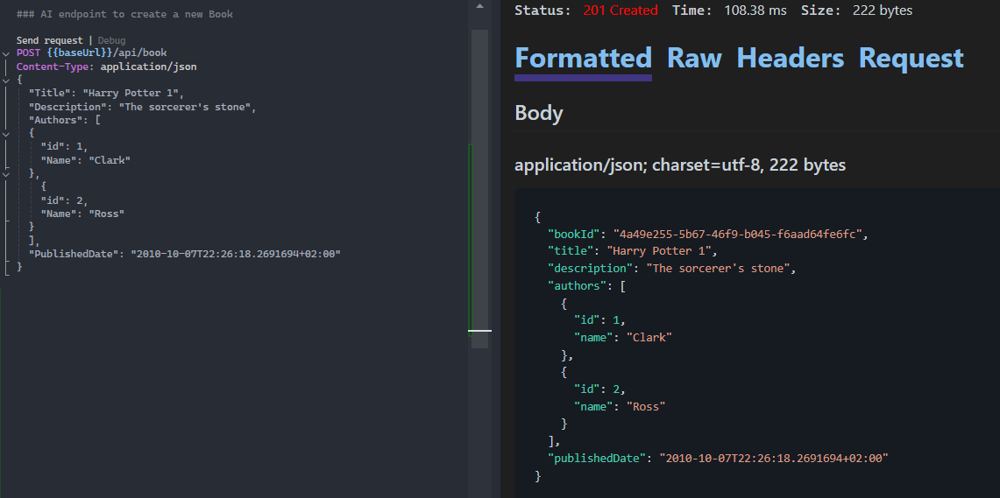
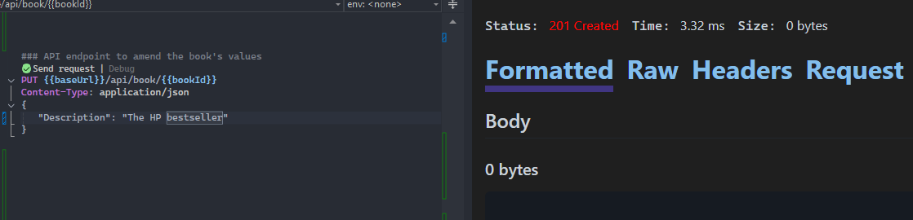
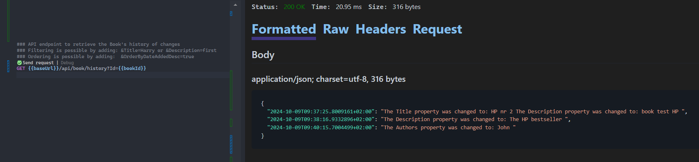
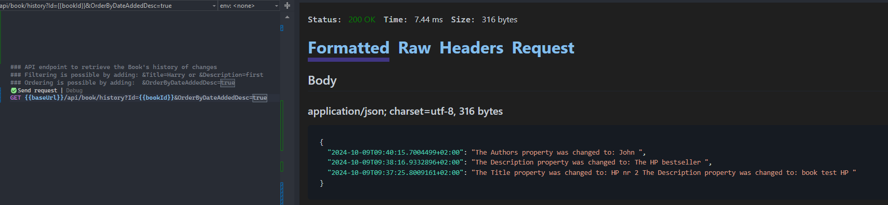
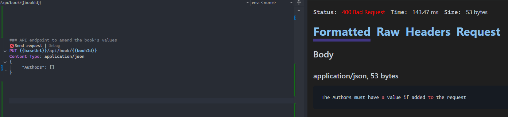

# Product Name
> Book Project

## Endpoints Examples

POST endpoint to create a new Book:

GET endpoint to retrieve a Book:

PUT endpoint to amend an already existing Book (single field):

PUT endpoint to amend an already existing Book (multiple fields):

GET endpoint to retrieve the latest version of a Book after applying the changes:

GET endpoint to retrieve a book's history:

GET endpoint to retrieve a book's history with ordering:

GET endpoint to retrieve a book's history with filtering:

## Endpoints Validation

The Book is not present in the in-memory DB:

Trying to amend a Book without adding any new fields in the JSON body:

Trying to amend a Book's field with a value that is the same as the latest value that the Book has:

Trying to amend a Book's field (Authors) with an already present Author in the list (check being done on Author's id)

Trying to amend a Book's field (Authors) with an empty list of Authors (theoretically a Book should have at least one author)

